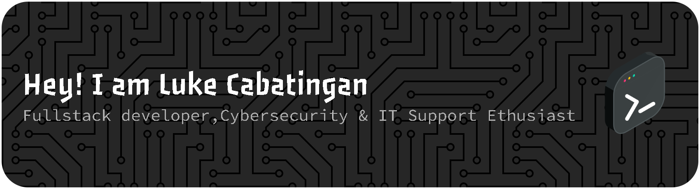

<table style="border: none; border-collapse: collapse;">
<tr>
<td valign="top">

### 👋 About Me
- 🎓 **3rd Year BSIT Student** & **Top Performing Student** at USTP.
- 👨‍💻 Currently building the **Pickarry Delivery Mobile System**.
- 🛡️ Passionate **IT Support & Cybersecurity Enthusiast**.
- 앰배서더 **IT Ambassador** for Google Developer Groups (GDG) USTP.
- 📫 **Let's connect:** cabatinganlukezichri@gmail.com

</td>
<td width="40%" align="center">

</td>
</tr>
</table>

### 📊 My GitHub Stats

  
  
  
   
  

 
 
  

  

 

  
</td>
<td width="40%" align="center">
